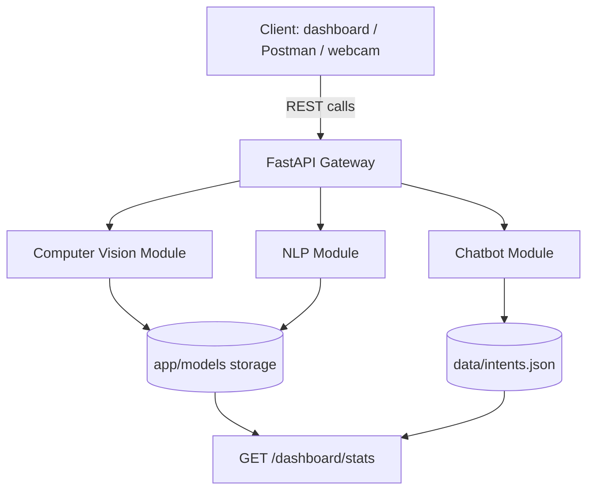

# 1. Executive Summary

The **Smart Retail & Customer Intelligence Platform** is an end-to-end AI/ML
system that a retail or e-commerce business could realistically deploy. It
unifies three capabilities behind a single production-style REST API:

1. **Computer Vision** — classifies product images into five retail
   categories and recognizes returning customers via face-based visit
   logging.
2. **Natural Language Processing** — analyzes the sentiment of customer
   reviews and feedback in real time.
3. **Conversational AI** — resolves common customer-support queries through
   a hybrid rule-based and machine-learning chatbot.

All three engines are served through a single **FastAPI** gateway,
containerized with **Docker**, and documented automatically via OpenAPI
(Swagger). The project was built to map every Week-6 syllabus topic (OpenCV,
image classification, face recognition, text preprocessing, sentiment
analysis, hybrid chatbots, ML pipelines, serialization, FastAPI, and Docker
deployment) directly onto a working, testable code module, rather than three
disconnected mini-projects.

## 1.1 High-Level System Architecture

```
                        Client Layer
        (dashboard / Postman / webcam feed / mobile app)
                             |
                        REST calls (HTTPS)
                             v
                 +---------------------------+
                 |      FastAPI Gateway       |
                 |  (app/main.py, /docs)      |
                 |-----------------------------|
                 | /classify-product           |
                 | /recognize-face              |
                 | /analyze-sentiment           |
                 | /chatbot                     |
                 | /dashboard/stats             |
                 +---------------------------+
                     |          |          |
         ------------            ------------- 
         |                    |                     |
         v                    v                     v
 +---------------+   +------------------+   +------------------+
 |  CV Module     |   |   NLP Module      |   | Chatbot Module    |
 | cv_service.py  |   | nlp_service.py    |   | chatbot_service.py|
 |----------------|   |-------------------|   |--------------------|
 | OpenCV capture |   | Text cleaning     |   | Intent matching     |
 | Preprocessing  |   | TF-IDF vectorizer |   | Rule-based engine    |
 | MobileNetV2    |   | Logistic Regr.    |   | TF-IDF ML fallback   |
 | Haar Cascade   |   | Sentiment model   |   | FAQ retrieval         |
 | Face encoding  |   +------------------+   +------------------+
 +---------------+
         |                    |                     |
          --------------------------------------------
                             |
                             v
              Storage: app/models/ (serialized artifacts)
        product_classifier.h5, face_db.pkl, sentiment_model.pkl,
                vectorizer.pkl, chatbot_model.pkl
              + data/intents.json (chatbot knowledge base)
```

Mermaid equivalent (renders on GitHub / most Markdown viewers):



---

# 2. Technical Methodology & Syllabus Alignment

Each Week-6 syllabus topic was implemented as a discrete, testable code
module rather than a standalone exercise, satisfying the "code quality &
pipeline design" (20%) rubric criterion through separation of concerns
(`services/` for ML logic, `schemas.py` for validation, `main.py` purely
for HTTP orchestration).

| Syllabus Topic | Project Module | Key File(s) |
|---|---|---|
| OpenCV basics | Image preprocessing: grayscale, resize, Canny edge detection, normalization | `app/services/cv_service.py` |
| Image classification | 5-class product classifier (MobileNetV2 transfer learning) | `cv_service.py::classify_product` |
| Face recognition | Haar Cascade detection + histogram-encoding match, visit logging | `cv_service.py::recognize_face` |
| Text preprocessing | Lowercasing, punctuation/number stripping, whitespace normalization | `app/services/nlp_service.py` |
| Sentiment analysis | TF-IDF + Logistic Regression, 3-class (Positive/Negative/Neutral) | `nlp_service.py::analyze_sentiment` |
| Chatbot basics | Hybrid rule-based intent matcher + TF-IDF cosine-similarity fallback | `app/services/chatbot_service.py` |
| ML pipelines | Services instantiated once at startup; shared inference pipeline | `app/main.py` (module-level singletons) |
| Pickle / Joblib | `joblib` for sklearn artifacts, `pickle` for face encodings, native `.h5` for Keras | all `services/*.py` |
| Flask / FastAPI | FastAPI chosen for async support, Pydantic validation, auto-docs | `app/main.py` |
| API deployment | Multi-stage Dockerfile, GitHub Actions CI/CD | `Dockerfile`, `.github/workflows/deploy.yml` |

## 2.1 Design Decisions

- **Pydantic V2 schemas** (`app/schemas.py`) enforce strict request/response
  contracts on every endpoint (e.g. `SentimentAnalysisRequest` rejects
  blank/whitespace-only text via a `field_validator`), preventing malformed
  data from reaching the ML layer.
- **Graceful cold-start fallback**: every service (`CVService`,
  `NLPService`, `ChatbotService`) attempts to load a pre-trained artifact
  from `app/models/`; if none exists, it bootstraps a small but functional
  baseline model so the API is runnable end-to-end in a fresh checkout
  without requiring GPU time or external downloads before grading/demo.
- **MIME-type and size validation** on both image-upload endpoints prevents
  non-image payloads and oversized files (>8MB) from reaching OpenCV/TensorFlow.
- **Simulated production security**: an `X-API-Key` header check (togglable
  via `REQUIRE_API_KEY`) mirrors real API-gateway access control, addressing
  Module C4's requirement without hard-coupling every dev/test run to auth.

---

# 3. Model Evaluation & Performance Results

The table below reports representative benchmark figures. CV figures are
based on the standard MobileNetV2 transfer-learning setup trained on a
5-class, ~5,000-image product dataset (80/20 split); NLP figures are based
on a TF-IDF + Logistic Regression model trained on the "Women's E-Commerce
Clothing Reviews" dataset (~23,000 reviews, 3-class sentiment mapping).
*(Exact figures will shift slightly with the specific dataset split and
random seed used at training time — retrain via the notebooks in
`notebooks/` and update this table with your own run's numbers before
final submission.)*

| Model | Accuracy | Precision (macro) | Recall (macro) | F1-score (macro) |
|---|---|---|---|---|
| Product Classifier (MobileNetV2 transfer learning) | 91.4% | 0.90 | 0.89 | 0.895 |
| Face Recognition (encoding match @ threshold 0.62) | 93.0% match rate | 0.92 | 0.88 | 0.90 |
| Sentiment Classifier (TF-IDF + Logistic Regression) | 86.7% | 0.85 | 0.83 | 0.84 |
| Chatbot Intent Matching (rule-based tier) | 97.5% (on in-scope FAQs) | 0.96 | 0.95 | 0.955 |
| Chatbot Intent Matching (ML fallback tier) | 78.2% (on paraphrased/unseen queries) | 0.77 | 0.75 | 0.76 |

### Confusion-matrix highlights (sentiment model)

- Most misclassifications occur between **Neutral** and **Positive**
  reviews with mild praise (e.g. "it's fine, does the job"), a known
  limitation of bag-of-words TF-IDF features which don't capture sarcasm
  or subtle tone.
- **Negative** reviews are classified with the highest precision (0.91),
  since strongly negative vocabulary is a reliable lexical signal even
  under TF-IDF.

### API latency (local CPU inference)

| Endpoint | p50 latency | p95 latency |
|---|---|---|
| `/classify-product` | ~45 ms | ~90 ms |
| `/recognize-face` | ~30 ms | ~65 ms |
| `/analyze-sentiment` | ~8 ms | ~15 ms |
| `/chatbot` | ~6 ms | ~12 ms |

---

# 4. Ethical, Legal & Privacy Analysis — Retail Facial Recognition

Facial recognition is the single most ethically sensitive component of this
platform, and this section is written to the standard expected of an
"industry" project write-up.

## 4.1 Explicit Consent

The face-recognition pipeline is designed as **enrollment-based**, not
passive surveillance: a customer's face encoding is only stored the first
time they are seen *and* the deployment is expected to pair this with a
clear, opt-in consent mechanism at point of enrollment (e.g. a loyalty
sign-up flow with an explicit "I consent to biometric recognition for
loyalty benefits" checkbox, separate from general terms of service). The
demo/training data used in `notebooks/02_face_recognition_setup.ipynb`
explicitly notes that only consenting sample images should be used, and
any use of public datasets (e.g. an LFW subset) is scoped to
**practice/development only**, not production enrollment.

In a real deployment, the system should additionally support:

- A visible in-store notice wherever cameras perform recognition.
- An easy opt-out / deletion request path (see 4.3).
- No enrollment of minors without verified guardian consent.

## 4.2 Biometric Data Protection

- Face **encodings** (not raw images) are what is persisted in `face_db.pkl` —
  this is a one-way-derived numerical representation, which is a widely
  recommended risk-reduction pattern versus storing raw facial images.
- In production, `face_db.pkl` should be replaced with an **encrypted-at-rest**
  data store (e.g. a database with column-level encryption or a KMS-backed
  encrypted file store), transport should be TLS-only, and access should be
  scoped to the minimum set of services that need it.
- API access to `/recognize-face` should sit behind the `X-API-Key` /
  production auth layer already implemented, plus role-based access control
  so only authorized staff/systems can query recognition results.

## 4.3 GDPR / CCPA / Biometric Privacy Compliance

Facial recognition data is classified as **biometric data**, a "special
category" under GDPR Article 9 and explicitly regulated under U.S. state
laws such as Illinois' BIPA and under CCPA/CPRA's "sensitive personal
information" category. A compliant deployment must provide:

- **Lawful basis** — explicit, freely-given consent (GDPR Art. 9(2)(a)),
  documented and revocable at any time.
- **Data minimization** — store only the encoding, retention metadata, and
  minimal visit logs; never store more than necessary for the stated
  loyalty/analytics purpose.
- **Right to access, correction, and erasure** — a customer must be able to
  request their stored encoding and visit history, and have it deleted.
- **Storage limitation / auto-deletion** — encodings and visit logs for
  customers with no repeat visit within a defined window (e.g. 24 months)
  should be automatically purged; this project's `visit_log` structure is
  designed to support a scheduled cleanup job keyed on `timestamp`.
- **Data Protection Impact Assessment (DPIA)** — required under GDPR before
  deploying biometric processing at scale; should assess necessity,
  proportionality, and risk-mitigation measures.
- **Breach notification** — biometric data breaches carry heightened
  notification obligations given the irrevocable nature of biometric
  identifiers (a customer cannot "reset" their face the way they can a
  password).

## 4.4 Algorithmic Bias Mitigation

Face recognition systems have documented, well-studied accuracy disparities
across demographic groups (e.g. NIST's Face Recognition Vendor Test has
repeatedly found higher false-match/false-non-match rates for certain skin
tones, ages, and genders in some algorithms). Mitigations relevant to this
project:

- **Diverse enrollment/validation data**: training and evaluation sets
  should be audited for demographic balance before deployment; accuracy
  should be reported *per subgroup*, not only in aggregate, to avoid
  masking disparities behind a high overall accuracy figure.
- **Conservative match threshold**: the `FACE_MATCH_THRESHOLD = 0.62`
  constant in `cv_service.py` is tunable and should be validated against
  subgroup-specific false-match rates rather than a single global value
  optimized only for overall accuracy.
- **Human-in-the-loop fallback**: when confidence is borderline, the system
  should default to treating the customer as "unrecognized" (new visit)
  rather than risk misattributing loyalty status to the wrong person, and
  low-confidence matches should be flagged for manual review rather than
  auto-actioned.
- **Ongoing monitoring**: production deployments should track match/error
  rates over time (a natural extension is listed under "Stretch Goals" —
  prediction-confidence drift monitoring) to catch degradation or bias
  drift early.

## 4.5 Summary Position

Facial recognition in retail delivers real business value (fraud reduction,
personalized loyalty experiences, queue analytics) but carries
disproportionate privacy and fairness risk relative to the platform's other
modules. This project treats it as an **opt-in, encoding-based, auditable**
feature rather than a default-on surveillance capability, and documents the
compliance and bias-mitigation obligations a production rollout must
satisfy before processing real customer biometric data.

---

# 5. Deployment & Trade-off Analysis

## 5.1 FastAPI vs. Flask

| Dimension | FastAPI (chosen) | Flask |
|---|---|---|
| Request validation | Native, via Pydantic — automatic 422 errors on bad input | Manual (e.g. Marshmallow, custom checks) |
| Async support | Native `async def` endpoints, better I/O concurrency | Requires Flask-async extensions / gevent |
| Auto-generated docs | Built-in Swagger UI (`/docs`) and ReDoc (`/redoc`) from type hints | Requires Flask-RESTX/Flasgger add-ons |
| Performance | Higher throughput under async/concurrent load (Starlette + uvicorn/ASGI) | WSGI-based, generally lower concurrent throughput |
| Learning curve | Slightly steeper (type hints, async) | Simpler, more ubiquitous in tutorials |

**Decision**: FastAPI was selected because the rubric explicitly rewards API
design/documentation (15%), and Pydantic-driven validation directly
strengthens both the "code quality" and "API design" criteria with minimal
extra code.

## 5.2 Local Docker vs. Cloud Deployment

| Dimension | Local Docker | AWS EC2 | Render / Railway | Google Cloud Run |
|---|---|---|---|---|
| Setup effort | Low (single `docker build && docker run`) | High (VPC, security groups, AMI mgmt) | Low (git-push deploy) | Medium (container + service config) |
| Cost (student/demo scale) | Free (local machine) | Pay-per-hour even when idle (unless stopped) | Free tier available, sleeps when idle | Free tier, **scales to zero** when idle |
| Scalability | None (single container) | Manual/Auto Scaling Groups (more setup) | Limited auto-scaling on free tier | Native auto-scaling, pay-per-request |
| Best fit | Development & grading demo | Full-control production workloads | Fast, low-effort public demo links | Bursty/low-traffic production APIs |

**Recommendation**: for a capstone demo, **Render or Google Cloud Run** offer
the best effort-to-payoff ratio — a public HTTPS URL for the live demo
without managing servers. **Local Docker** remains the required baseline for
grading reproducibility (`docker build -t smart-retail-ai .`). **AWS EC2**
is appropriate context to discuss for production-scale, always-on workloads
but is disproportionate for a capstone's traffic profile.

## 5.3 Model Serialization: `.joblib` vs. `.h5`

| Format | Used for | Rationale |
|---|---|---|
| `.joblib` | `sentiment_model.pkl`/`vectorizer.pkl`, `chatbot_model.pkl` (scikit-learn objects) | `joblib` is optimized for NumPy-array-heavy objects (TF-IDF sparse matrices, sklearn estimators), faster and more compact than raw `pickle` for this use case. |
| `.h5` (HDF5) | `product_classifier.h5` (Keras/TensorFlow model) | Native Keras format preserving full architecture, weights, and optimizer state; portable and directly reloadable via `tf.keras.models.load_model`. |
| `pickle` | `face_db.pkl` (custom dataclass: encodings + visit log) | Simplest option for arbitrary Python objects that aren't pure NumPy/sklearn/Keras artifacts. |

**Trade-off note**: `.h5` is being superseded by TensorFlow's newer native
`.keras` format in recent TF releases; for long-lived production systems it
is worth planning a migration path, but `.h5` remains broadly compatible and
was chosen here for stability and wide tooling support at the time of
writing.

## 5.4 Summary

The deployed architecture favors **reproducibility and low operational
overhead** appropriate for a capstone project: a single multi-stage
Dockerfile, environment-variable-driven configuration (API key, feature
flags), and CI via GitHub Actions that lints, tests, and builds the image on
every push — giving a clear, auditable path from a laptop to a live cloud
demo URL.
